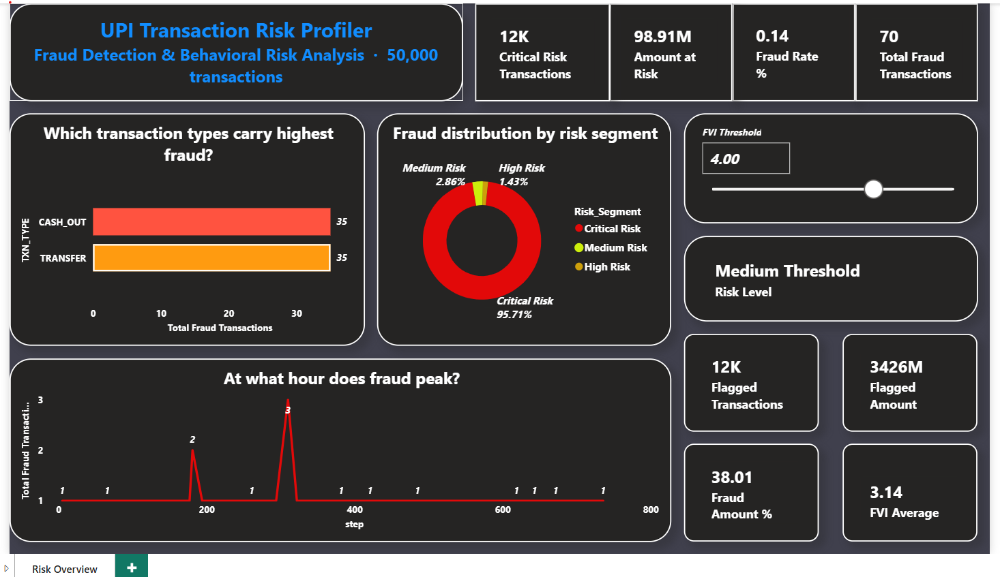

# 🔍 UPI Transaction Risk Profiler

_Detecting fraudulent UPI payment behavior using behavioral risk scoring, SQL analysis, and an interactive Power BI dashboard._

---

## 📌 Table of Contents
- <a href="#overview">Overview</a>
- <a href="#business-problem">Business Problem</a>
- <a href="#dataset">Dataset</a>
- <a href="#tools--technologies">Tools & Technologies</a>
- <a href="#project-structure">Project Structure</a>
- <a href="#data-cleaning--preparation">Data Cleaning & Preparation</a>
- <a href="#exploratory-data-analysis">Exploratory Data Analysis</a>
- <a href="#fraud-velocity-index">Fraud Velocity Index (FVI)</a>
- <a href="#key-findings">Key Findings</a>
- <a href="#sql-analysis">SQL Analysis</a>
- <a href="#dashboard">Dashboard</a>
- <a href="#business-recommendations">Business Recommendations</a>
- <a href="#how-to-run">How to Run This Project</a>
- <a href="#author">Author & Contact</a>

---

<h2><a class="anchor" id="overview"></a>Overview</h2>

This project builds a UPI Transaction Risk Profiler to detect anomalous 
payment behavior and flag high-risk transactions before financial loss occurs. 
A complete data pipeline was built using Python for EDA and feature engineering, 
MySQL for database design and SQL analysis, and Power BI for an interactive 
fraud detection dashboard with a live What-If risk simulator.

---

<h2><a class="anchor" id="business-problem"></a>Business Problem</h2>

UPI processed 17,220 crore transactions worth Rs. 246 lakh crore in FY2024-25, 
making India the world's largest real-time payments market by volume. With fraud 
cases rising, banks need automated behavioral risk detection systems that go 
beyond static rules. This project aims to:

- Identify which transaction types carry the highest fraud risk
- Detect peak fraud hours for targeted automated monitoring
- Build a behavioral risk score (FVI) that outperforms static threshold rules
- Segment transactions into actionable risk tiers for operations teams
- Provide a live Power BI simulator for risk threshold tuning

---

<h2><a class="anchor" id="dataset"></a>Dataset</h2>

| Property | Detail |
|---|---|
| Source | PaySim Financial Dataset |
| Total Size | 6.3 million transactions, 11 features |
| Fraud Rate | 0.13% — 8,213 fraudulent transactions |
| Fraud Types | TRANSFER and CASH_OUT only |
| Sample Used | 50,000 rows loaded into MySQL & Power BI |

**Key columns:**
- `step` — hour of transaction (1–744)
- `type` — transaction type (PAYMENT, TRANSFER, CASH_OUT, DEBIT, CASH_IN)
- `amount` — transaction amount
- `oldbalanceOrg / newbalanceOrig` — sender balance before and after
- `oldbalanceDest / newbalanceDest` — receiver balance before and after
- `isFraud` — fraud label (0 = normal, 1 = fraud)

---

<h2><a class="anchor" id="tools--technologies"></a>Tools & Technologies</h2>

| Tool | Purpose |
|---|---|
| Python (Pandas, NumPy, Matplotlib, Seaborn) | EDA, feature engineering, visualization |
| MySQL | Database design, SQL analysis queries |
| Power BI | Interactive dashboard, What-If simulator |
| ReportLab | PDF summary report generation |
| GitHub | Version control, project documentation |

---

<h2><a class="anchor" id="project-structure"></a>Project Structure</h2>

```text
📦 upi-fraud-risk-analyzer
├── 📄 README.md
├── 📁 data
│   ├── PS_20174392719_1491204439457_log.csv
│   ├── upi_engineered.csv
│   └── powerbi_data.csv
│
├── 📁 notebooks
│   ├── 01_eda_exploration.ipynb
│   ├── 02_eda_visualization.ipynb
│   ├── 03_feature_engineering.ipynb
│   ├── 04_mysql_load.ipynb
│   └── 05_pdf_summary.ipynb
│
├── 📁 sql
│   └── analysis.sql
│
├── 📁 powerbi
│   └── upi_fraud_dashboard.pbix
│
└── 📁 outputs
    ├── fraud_by_type.png
    ├── fraud_by_hour.png
    ├── amount_distribution.png
    ├── dashboard_final.png
    └── upi_fraud_risk_report.pdf
```

<h2><a class="anchor" id="data-cleaning--preparation"></a>Data Cleaning & Preparation</h2>

- Verified zero missing values across all 6.3M rows
- Confirmed fraud exists only in TRANSFER and CASH_OUT types
- Removed irrelevant column `isFlaggedFraud` (only 16 flagged vs 8,213 actual fraud)
- Engineered 4 new behavioral features from existing columns
- Sampled 50,000 rows (random_state=42) for MySQL and Power BI

---

<h2><a class="anchor" id="exploratory-data-analysis"></a>Exploratory Data Analysis</h2>

**Key observations from EDA:**

- Dataset is heavily imbalanced — only 0.13% fraud rate
- Fraud is exclusively in TRANSFER (0.84% rate) and CASH_OUT (0.20% rate)
- Fraud transactions show a flatter amount distribution — fraudsters avoid 
  triggering fixed threshold alerts by staying in mid-range amounts
- Fraud peaks around step 300 — 3x higher than average hours
- Strong correlation between Purchase Qty and fraud account balance drain

**Outliers identified:**
- Fraud amounts range from small to exactly Rs. 1 crore (top accounts)
- Balance mismatch values highly skewed in fraud transactions
- Zero drain pattern present in 96%+ of fraud cases

---

<h2><a class="anchor" id="fraud-velocity-index"></a>Fraud Velocity Index (FVI)</h2>

FVI is a custom behavioral risk score created for this project, combining 
three transaction signals into a single risk number on a 0–6 scale.

| Signal | Logic | Weight |
|---|---|---|
| Balance Mismatch | Account balances do not reconcile after transaction | 2 points |
| Zero Drain | Account wiped to zero after transaction | 3 points |
| Amount Ratio | Transaction unusually large relative to account balance | 0–1 points |

**Formula:**

FVI = (mismatch_flag × 2) + (zero_drain × 3) + (amount_ratio clipped to 1)

**Validation results:**

| Group | Mean FVI |
|---|---|
| Fraud transactions | 3.948 |
| Normal transactions | 3.133 |

Fraud transactions score **26% higher** on average. Critical Risk segment 
(FVI ≥ 4.0) captures **95.7% of all actual fraud.**

---

<h2><a class="anchor" id="key-findings"></a>Key Findings</h2>

**Finding 1 — Fraud concentrated in 2 transaction types**
100% of fraud occurs in TRANSFER (0.84% rate) and CASH_OUT (0.20% rate).
PAYMENT, DEBIT, and CASH_IN show zero fraud. Risk monitoring can focus 
exclusively on these two types, reducing screening cost by 60%+.

**Finding 2 — Fraud peaks at specific hours**
Fraud spikes around step 300 with 3x higher volume than average hours. 
Automated monitoring should be strongest during this window when human 
oversight is lowest.

**Finding 3 — FVI successfully separates fraud from normal**

| Risk Segment | Transactions | Actual Fraud | Fraud Rate |
|---|---|---|---|
| Critical Risk (FVI ≥ 4) | 12,012 | 67 | 0.56% |
| High Risk (FVI 3–4) | 20,134 | 1 | 0.00% |
| Medium Risk (FVI 1.5–3) | 10,549 | 2 | 0.02% |
| Low Risk (FVI < 1.5) | 7,305 | 0 | 0.00% |

**Finding 4 — High value, single-use fraud accounts**
Top fraud accounts each transferred exactly Rs. 1 crore in a single 
transaction. Every fraud account was used exactly once — making traditional 
blacklisting ineffective and behavioral scoring essential.

---

<h2><a class="anchor" id="sql-analysis"></a>SQL Analysis</h2>

Four queries written and saved in `sql/analysis.sql`:

| Query | Technique Used |
|---|---|
| Fraud rate by transaction type | GROUP BY, aggregation, ROUND |
| High value fraud account identification | WHERE, GROUP BY, ORDER BY |
| Hourly fraud trend with running total | Window function — SUM() OVER |
| FVI risk segmentation | CASE WHEN, GROUP BY |

**Highlight — Window function query:**
```sql
SELECT 
    step AS hour,
    SUM(is_fraud) AS hourly_fraud,
    SUM(SUM(is_fraud)) OVER (ORDER BY step) AS running_total,
    ROUND(AVG(fvi), 3) AS avg_fvi
FROM transactions
GROUP BY step
ORDER BY step;
```

---

<h2><a class="anchor" id="dashboard"></a>Dashboard</h2>

Power BI dashboard contains:
- 4 KPI cards: Critical Risk count, Amount at Risk, Fraud Rate, Total Fraud
- Bar chart: Fraud count by transaction type
- Donut chart: FVI risk segment distribution
- Line chart: Fraud transactions by hour
- **What-If FVI Simulator**: Live slider to adjust detection threshold 
  and see flagged transactions update in real time



---

<h2><a class="anchor" id="business-recommendations"></a>Business Recommendations</h2>

**Recommendation 1 — Focus screening on TRANSFER and CASH_OUT**
Flag all TRANSFER and CASH_OUT transactions above Rs. 50,000 for enhanced 
automated screening. These are the only two types with confirmed fraud activity.

**Recommendation 2 — Set FVI operational threshold at 4.0**
An FVI of 4.0 captures 95.7% of fraud while limiting review to 24% of 
transactions — optimal balance between detection and operational cost.

**Recommendation 3 — Heighten monitoring during peak fraud hours**
Deploy enhanced automated alerts during step 280–320. Fraud volume in this 
window is 3x the daily average.

**Recommendation 4 — Replace blacklisting with behavioral scoring**
Since every fraud account is used exactly once, account blacklisting has 
zero effectiveness. FVI-based transaction scoring is the correct long-term 
approach, consistent with RBI's 2024 revised guidelines on early warning systems.

---

<h2><a class="anchor" id="how-to-run"></a>How to Run This Project</h2>

1. Clone the repository:
```bash
git clone https://github.com/Kapilmali07/upi-fraud-risk-analyzer.git
```

2. Install required libraries:
```bash
pip install pandas numpy matplotlib seaborn sqlalchemy pymysql reportlab
```

3. Run notebooks in order:
   - `notebooks/01_eda_exploration.ipynb`
   - `notebooks/02_eda_visualization.ipynb`
   - `notebooks/03_feature_engineering.ipynb`
   - `notebooks/04_mysql_load.ipynb`
   - `notebooks/05_pdf_summary.ipynb`

4. Run SQL queries:
   - Open MySQL Workbench
   - Connect to `upi_fraud_db`
   - Run `sql/analysis.sql`

5. Open Power BI Dashboard:
   - `powerbi/upi_fraud_dashboard.pbix`

---

<h2><a class="anchor" id="author"></a>Author & Contact</h2>

**Kapil Mali**  
Senior Data Analyst | Kantar Analytics, Pune
🔗 LinkedIn: [LinkedIn.com/Kapil-Mali](https://www.linkedin.com/in/kapil-mali/)
🔗 GitHub: [github.com/Kapilmali07](https://github.com/Kapilmali07)  
🔗 Project: [upi-fraud-risk-analyzer](https://github.com/Kapilmali07/upi-fraud-risk-analyzer)
